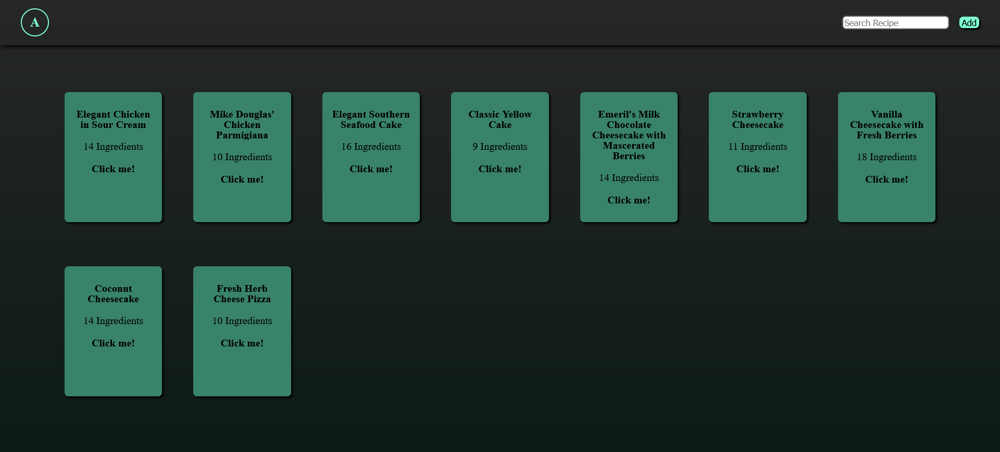

# Recipe App

A full-stack recipe management app with a frontend for browsing and adding recipes. Recipes are fetched from the **API Ninjas Recipe API**, with a backend layer to manage existing recipes and prevent duplicates.

## Screenshots



## Features

- Browse recipes with ingredient counts displayed in responsive recipe boxes
- Add new recipes by title; automatically checks if a recipe already exists before calling the API
- Uses **API Ninjas** to fetch recipe details including ingredients and instructions
- Backend API routes: `get-recipes`, `add-recipe`, `check-recipe`
- Responsive grid layout for recipe display — adjusts automatically on mobile and desktop
- Handles long recipe titles gracefully using ellipsis and wrapping

## Technologies

- **Frontend:** HTML, CSS, JavaScript
- **Backend:** Node.js + Sequelize ORM (for storing local recipe metadata)
- **External API:** API Ninjas Recipe API

## Setup

### Prerequisites

- Node.js (v14 or higher)
- API Ninjas API Key ([Get one here](https://api-ninjas.com/))

### Installation

1. Clone the repository:
```bash
git clone https://github.com/yourusername/recipe-app.git
cd recipe-app
```

2. Install dependencies:
```bash
npm install
```

3. Create a `.env` file in the root directory:
```env
API_NINJAS_KEY=your_api_key_here
```

4. Run the development server:
```bash
npm start
```

5. Open your browser and navigate to `http://localhost:3000`

## Deployment

This app is deployed on **Render**:

1. Push your code to GitHub
2. Create a new Web Service in Render
3. Connect your GitHub repository
4. Add your `API_NINJAS_KEY` environment variable in Render settings
5. Deploy!

**[Live Demo](https://recipes-hdm5.onrender.com/)**

## API Routes

- `GET /api/get-recipes` - Fetch all stored recipes
- `POST /api/add-recipe` - Add a new recipe (fetches from API Ninjas)
- `GET /api/check-recipe?title={title}` - Check if recipe exists in database

## Project Structure

```
recipe-app/
├── api/                  # API routes
│   ├── get-recipes.js
│   ├── add-recipe.js
│   └── check-recipe.js
├── public/               # Frontend files
│   ├── index.html
│   ├── styles.css
│   └── app.js
├── screenshots/          # App screenshots
│   └── screenshot.png
├── .env                  # Environment variables (not committed)
├── package.json
└── README.md
```

## Acknowledgments

- [API Ninjas](https://api-ninjas.com/) for providing the recipe API
